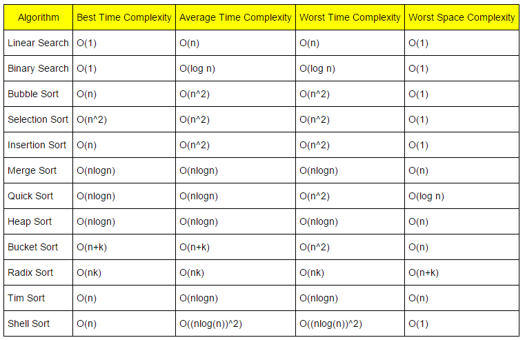

 

# Bubble sort
### Algorithm
1. Start from first elem
2. compare the curr elem with the next elem
3. swap (if required)
4. move to the next element and keep doing for (n-2) pos element
5. repeat 
6. Continue until sorted 
 
 

# Selection Sort
### Algorithm
The idea behind this is:-
we divide the array(virtually) into two sections sorted and unsorted.
 

1. Start: whole array is unsorted
2. find the smallest elem -> min
3. swap the min with first element
4. now sorted section has one elem
5. keep repeating the process until the whole array is sorted
 
 

# Insertion Sort
### Algorithm
idea: place each element 
1. Start with second elem
2. compare the curr elem with the predecessor
3. shift or swap as necessary
4. move to the next element and repeat till sorted

# Merge Sort
### Algorithm 
1. Divide: Find the middle point to divide the array into two halves:
2. Conquer: Recursively sort the two halves
3. Combine: Merge the two halves sorted in step 2
4. Base Case: If the array has less than two elements, return it as it is already sorted.

# Quick Sort 
1. Start from first element and choose it as a pivot
2. l = 0, r = n-1 and pos(pos of pivot) = 0
3. from r to pos: (r--)
    if(elem.pos > elem.r):
    swap
    pos = r
    r++
    l++
4. from l to pos: (l++)
    if(elem.pos < elem.l)
    swap
    pos = l
    l--
    r--
5. repeat until base case(r-l <= 1)

